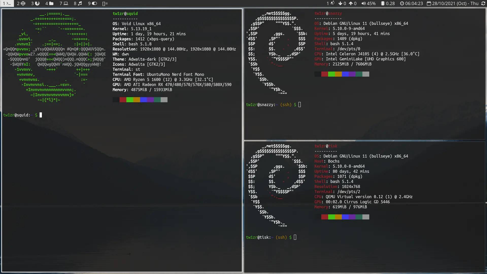
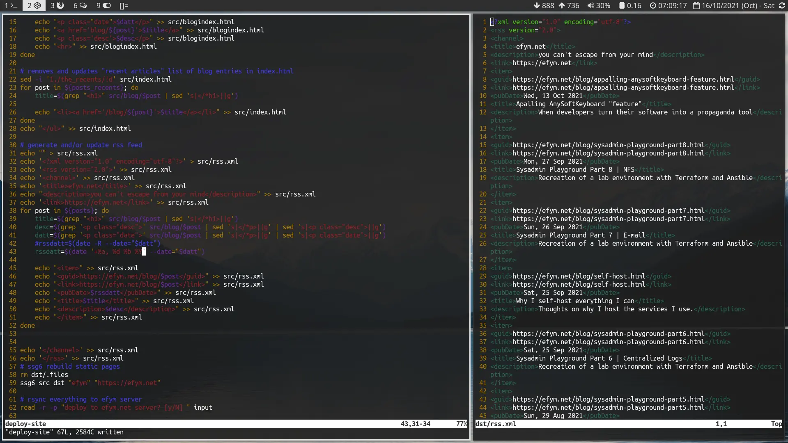
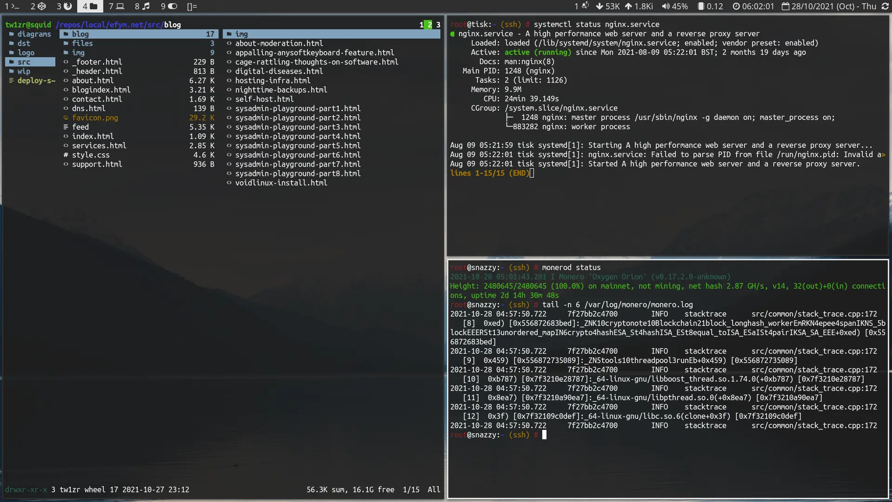
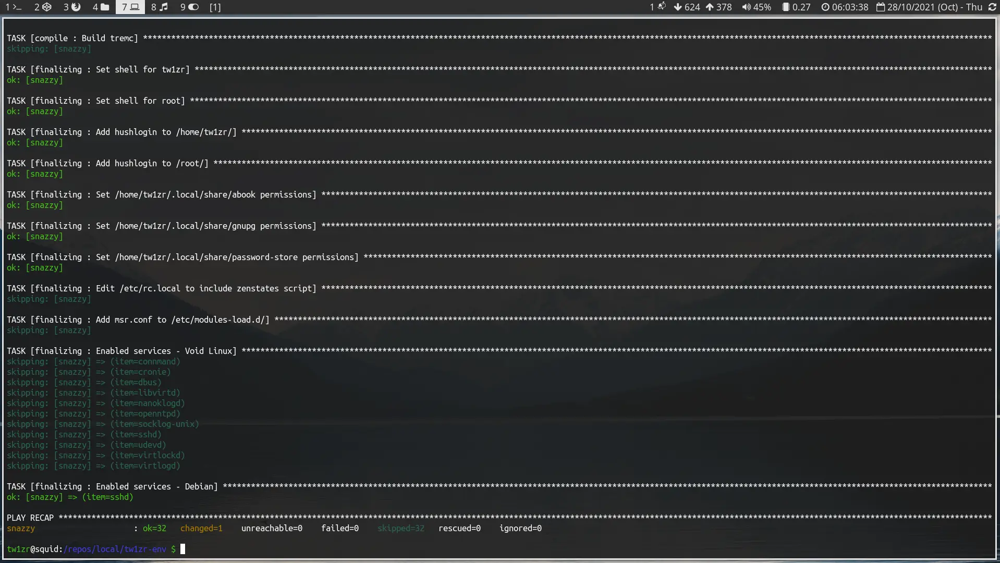
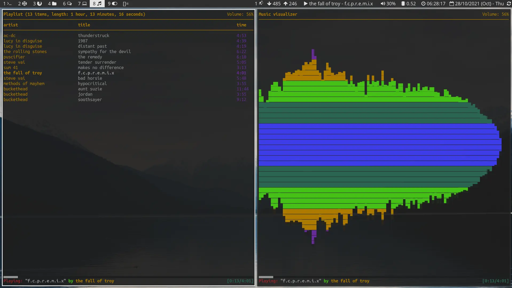
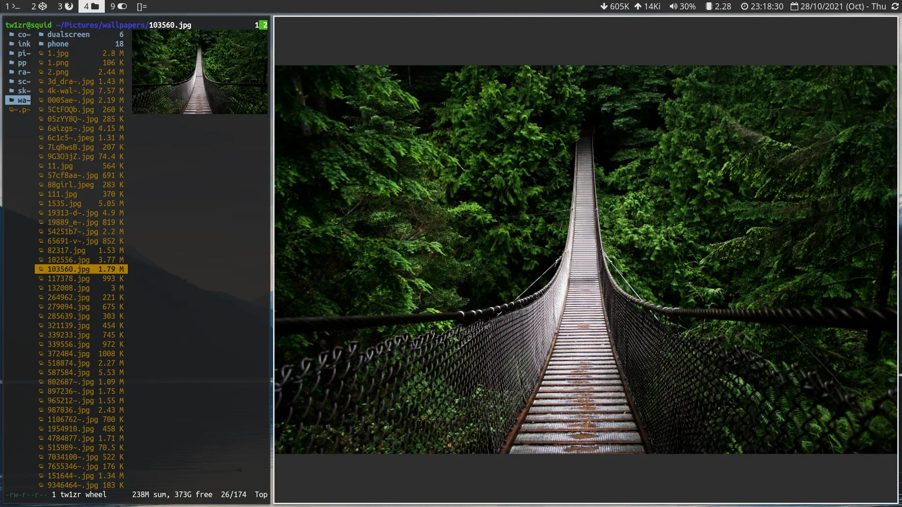
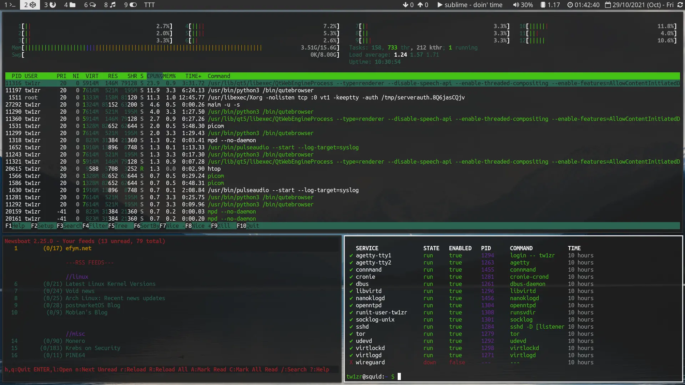

## Intro

I'm **tw1zr**, a dedicated **GNU/Linux** sysadmin, DevOps Engineer and free software advocate. My real name is George, well met.

I navigate the inner depths of servers from the ominous black boxes known as terminal emulators.

## Software and Workflow

I _exclusively_ use **GNU/Linux** on every device. My desktop and laptop run [Arch Linux](https://archlinux.org) while my servers are powered by [Debian](https://debian.org), usually inside a [Proxmox](https://proxmox.com) hypervisor.

A staunch **neovim** enthusiast, I customise 99% of my computer interactions with **vim**-like keybindings and rely heavily on the command line for most tasks.

Here's my essential toolkit:

- **Window Manager:** [awesomeWM](https://github.com/awesomeWM/awesome)
- **Application Launcher:** [rofi](https://github.com/davatorium/rofi)
- **Terminal Emulator:** [alacritty](https://github.com/alacritty/alacritty)
- **Text Editor:** [neovim](https://github.com/neovim/neovim)
- **File Manager:** [yazi](https://github.com/sxyazi/yazi)
- **Music Player:** [mpd](https://github.com/MusicPlayerDaemon/MPD) + [ncmpcpp](https://github.com/ncmpcpp/ncmpcpp)
- **Video Player:** [mpv](https://github.com/mpv-player/mpv)
- **Image Viewer:** [nsxiv](https://codeberg.org/nsxiv/nsxiv)
- **Password Manager:** [password-store](https://git.zx2c4.com/password-store)
- **Web Browsers:** [qutebrowser](https://github.com/qutebrowser/qutebrowser), [Firefox](https://www.mozilla.org/en-GB/firefox) & [LibreWolf](https://librewolf.net)

These are my primary tools, though my toolkit is always expanding.

### Gallery

Here are a few screenshots showcasing my setup during various activities:


  
  
  
  
  
  
  
  


I prefer the command line for its efficiency and precision—unlike my younger self who was dazzled by the flashy, fast-paced visuals of computers. However, for tasks that demand graphical interfaces, like photo or video editing, I opt for tools like [GIMP](https://gimp.org), [OpenShot](https://openshot.org), [ImageMagick](https://imagemagick.org), and [FFmpeg](https://ffmpeg.org).

## Technical Proficiencies

Check out my [Sysadmin Playground](/posts/sysadmin-playground01-intro) series for in-depth deployments. Here’s a snapshot of my skill set:

### Systems & Infrastructure

- **GNU/Linux:** Expertise in various distributions, deeply familiar with system internals.
- **Kubernetes:** Orchestrating containerised applications for scalable deployments.
- **GitOps with ArgoCD:** Implementing declarative infrastructure and continuous delivery for Kubernetes.
- **Infrastructure as Code:** [Terraform](https://www.terraform.io) for provisioning, [Ansible](https://ansible.com) for configuration management and orchestration.
- **Containerisation:** [Docker](https://docker.com) for building and managing containers.
- **Web Hosting:** [nginx](https://www.nginx.com) and [Apache](https://apache.org) for serving web applications.
- **Ingress controller & reverse proxy:** [Traefik](https://traefik.io) for dynamic routing and load balancing.
- **Static Site Generation:** [Hugo](https://gohugo.io) for building fast, static websites.
- **CI/CD:** [CircleCI](https://circleci.com) for continuous integration and deployment pipelines.
- **Monitoring & Logging:** [Nagios](https://nagios.com), [Checkmk](https://checkmk.com), [Prometheus](https://prometheus.io), [Grafana](https://grafana.com), and [Datadog](https://www.datadoghq.com) for comprehensive infrastructure and application monitoring.
- **Version Control:** Managing code and infrastructure with [Git](https://git-scm.com).

### Cloud Services

- **AWS Expertise:** Proficient with services like ECS, EKS, EC2, S3, RDS, and Lambda, enabling robust and scalable cloud architectures.

### Networking

- **In-Depth Networking Knowledge:** Comprehensive understanding of network protocols, security, and infrastructure design.

### Programming & Scripting

- **Languages:** Proficient in Go, PHP, Python, and bash for automation and development.

### Self-Hosted Services

For years, I’ve been self-hosting every service possible on my infrastructure. Learn more in my [Why I Self-Host Everything I Can](/blog/why-i-self-host) post. My self-hosted services include:

- **VPN Servers:** [WireGuard](https://wireguard.com) and [OpenVPN](https://openvpn.com) for secure connections.
- **E-mail Servers:** [Postfix](http://www.postfix.org) and [Dovecot](https://dovecot.org) with web interfaces like [Roundcube](https://roundcube.net).
- **Media Servers:** [Jellyfin](https://jellyfin.org) for streaming media.
- **Cryptocurrency Nodes:** Running a [Monero (XMR)](https://getmonero.org) node accessible via **Tor** and **WireGuard**.
- **Git Servers:** Utilising [cgit](https://git.zx2c4.com/cgit), [Gitea](https://gitea.io), and [Forgejo](https://forgejo.org) for version control.
- **Chat Servers:** [Prosody](https://prosody.im) for XMPP and [Synapse](https://github.com/matrix-org/synapse), [Dendrite](https://github.com/matrix-org/dendrite), [Conduit](https://gitlab.com/famedly/conduit) with [Element](https://element.io) for Matrix.
- **File Servers:** [Nextcloud](https://nextcloud.com), [Seafile](https://seafile.com), and protocols like **FTP**, **SFTP**, **SMB**, and **NFS**.
- **Search Engines:** [Searx](https://searx.github.io) for a decentralised meta-search experience.
