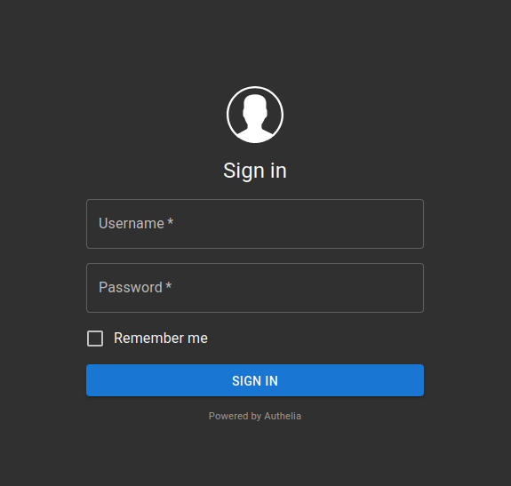

## Preamble

In my Kubernetes cluster I host many services, some of which require authentication. I wanted to centralise the management of that authentication for all of my cluster's users.

There are many popular choices to accomplish this, some proprietary enterprise level like [Okta](https://www.okta.com) and [Cognito](https://aws.amazon.com/cognito). Also some really good open source ones like [Authentik](https://goauthentik.io), [Kanidm](https://kanidm.com) and [Keycloak](https://www.keycloak.org).

Today I'll be showing [Authelia](https://www.authelia.com). I chose it primarily because it allows user management via a YAML file to keep a database of users. I particularly like this because it allows me to deploy it as a stateless deployment inside Kubernetes; no external databases or StatefulSets. Big plus in my book.

## Objective

By the end every service I want to protect (each accessible via different subdomains) with either one factor (username and password) or two factor (TOTP) should show the following login page before being able to access it:



## Architecture overview

```text
                                +------------------------+
                                |     User's Browser     |
                                +-----------+------------+
                                            |
                                            v
                             HTTPS request to protected service
                                            |
                                            v
                              +-------------+--------------+
                              |       Traefik Ingress      |
                              | (ingress controller w/     |
                              |  Authelia middleware)      |
                              +-------------+--------------+
                                            |
                      Is the user authenticated? ───┐
                                            |       |
                         No: forward to Authelia    |
                                            |       |
                                            v       |
                             +--------------+---------------+
                             |           Authelia           |
                             | (Stateless, Config from      |
                             |  template + secret data)     |
                             +--------------+---------------+
                                            |
                         Login with password or TOTP (2FA)  |
                                            |
                         Auth success → Redirect to service |
                                            |               |
                                            v               |
                              +-------------+--------------+
                              |    Protected Service (e.g. |
                              |        Karakeep)           |
                              +----------------------------+

OIDC flow for apps that support it (like Karakeep)

    +--------------------+
    |    Karakeep        |
    |  (OIDC Relying     |
    |    Party)          |
    +---------+----------+
              |
              | Redirect to Authelia for login
              v
    +---------+----------+
    |     Authelia       |
    | (OIDC Provider)    |
    +---------+----------+
              |
              | Token/claims (via redirect)
              v
    +---------+----------+
    |    Karakeep        |
    | (accepts token and |
    |  grants access)    |
    +--------------------+

```
## Part 1. Stateless Authelia

Authelia is deployed in a completely stateless manner using an init container that renders its configuration from a template stored in a ConfigMap. All sensitive data (such as secrets, private keys, and the user database) are stored securely with sops+age.

The directory structure will look as follows:
```
.
├── config.yaml
├── deployment.yaml
├── ingress.yaml
├── kustomization.yaml
├── middleware.yaml
├── namespace.yaml
├── secret.yaml
└── service.yaml
```

I use Kustomize and Flux to deploy all my manifests and Helm charts. I will briefly touch on my usage of Kustomize here but details about those two things are out of scope for this article. Maybe I'll expand on the topics in another one.

### 1.1. Create a namespace

I started by creating a dedicated namespace for Authelia:

```yaml
apiVersion: v1
kind: Namespace
metadata:
  name: authelia
```

### 1.2. Secure sensitive data with sops+age

I use sops+age to manage all secrets (so that raw values never appear in git). Here's an example manifest for Authelia:

```yaml
kind: Secret
apiVersion: v1
metadata:
    name: authelia
    namespace: authelia
type: Opaque
stringData:
    JWT_SECRET: ENC[AES256_GCM,data:IhDBfLnivCMifccSBcZsV00t... (truncated)
    SESSION_SECRET: ENC[AES256_GCM,data:I6czxP0PLYOo7MRD+G8I... (truncated)
    ENCRYPTION_KEY: ENC[AES256_GCM,data:o/N0ueAUyQWDUoL8hPLd... (truncated)
    HMAC_SECRET: ENC[AES256_GCM,data:RHvBUpp2lzXvmS2S5VLZC3G... (truncated)
    ISSUER_PRIVATE_KEY: ENC[AES256_GCM,data:jIOseYZphoy6UsPY... (truncated)
    KARAKEEP_CLIENT_SECRET: ENC[AES256_GCM,data:G98OXfp+dr+/... (truncated)
    users.yml: ENC[AES256_GCM,data:UVIZ3hmINQl3/P/L5TmO+YZoL... (truncated)
sops:
    age:
        - recipient: age166emlwc4zzzdzfjeurrxtk05wnz6dqxdnujr2u6h63c800dutsxstyl7n9
          enc: |
            -----BEGIN AGE ENCRYPTED FILE-----
            YWdlLWVuY3J5cHRpb24ub3JnL3YxCi0+IFgyNTUxOSB3dk4xbGFieTFlNTR3a0FI
            K0ZScUJUdVVYajR0d3UvL2VjYWp0dU1RazFvCmxsbm01YnV0b29UOURPa0dFVjZ4
            aGx4QXJ2azdBN25ka3VwRTJxSmdoYU0KLS0tIE5tblV5NjJXUFlXK24rbmlXeXJV
            V3NSeEJKRHB5bXU4bEIwUFdUZkpBWVUKFGwcXUWBaLC/rliC8dcCQ94jbh9wqWu1
            Cj4e7J4N4SxZaFe29+UxmznNiwMhLXUQSBNewr98rjcSgQBg7HLzGA==
            -----END AGE ENCRYPTED FILE-----
    lastmodified: "2022-07-17T09:43:17Z"
    mac: ENC[AES256_GCM,data:ZHfj... (truncated)
    encrypted_regex: ^(data|stringData)$
    version: 3.9.2
```

### 1.3. Define the configuration template

To keep Authelia stateless, I don’t want to mount a writable ConfigMap directly (since ConfigMaps are read‑only). Instead, I store a configuration template in a ConfigMap and use an init container to render the final configuration file.

```yaml
apiVersion: v1
kind: ConfigMap
metadata:
  name: authelia-config
  namespace: authelia
data:
  configuration.tpl.yml: |
    server:
      address: 0.0.0.0:9091

    log:
      level: info

    identity_validation:
      reset_password:
        jwt_secret: ${JWT_SECRET}

    authentication_backend:
      password_reset:
        disable: true
      file:
        path: /secrets/users.yml
        password:
          algorithm: argon2id
          iterations: 1
          salt_length: 16
          parallelism: 8
          memory: 64

    access_control:
      default_policy: one_factor
      rules:
        - domain:
            - "efym.net"
            - "login.efym.net"
          policy: bypass
        - domain:
            - "*"
          policy: one_factor
        - domain:
            - "adguard1.efym.net"
            - "adguard2.efym.net"
          subject:
            - "group:users"
          policy: deny

    session:
      name: authelia_session
      same_site: lax
      secret: ${SESSION_SECRET}
      expiration: 8h
      inactivity: 8h
      cookies:
        - domain: "efym.net"
          authelia_url: "https://login.efym.net"
          default_redirection_url: "https://efym.net"

    regulation:
      max_retries: 5
      find_time: 2m
      ban_time: 10m

    theme: dark

    storage:
      encryption_key: ${ENCRYPTION_KEY}
      local:
        path: /config/db.sqlite3

    notifier:
      filesystem:
        filename: /config/notification.txt

    identity_providers:
      oidc:
        claims_policies:
          legacy:
            id_token:
              - email
              - email_verified
              - name
              - preferred_username
              - groups
        hmac_secret: ${HMAC_SECRET}
        issuer_private_key: |
          ${ISSUER_PRIVATE_KEY}
        clients:
          - client_id: karakeep
            client_name: Karakeep
            client_secret: ${KARAKEEP_CLIENT_SECRET}
            public: false
            authorization_policy: one_factor
            require_pkce: false
            pkce_challenge_method: ''
            redirect_uris:
              - 'https://links.efym.net/api/auth/callback/custom'
            scopes:
              - 'openid'
              - 'email'
              - 'profile'
            response_types:
              - 'code'
            grant_types:
              - 'authorization_code'
            claims_policy: 'legacy'
            consent_mode: implicit
            access_token_signed_response_alg: 'none'
            userinfo_signed_response_alg: 'none'
            token_endpoint_auth_method: 'client_secret_basic'
```


Notice how the issuer_private_key field uses a block scalar (|) so that newlines are preserved and YAML remains valid after substitution.
Also important to know that I stored the key with 6 spaces of indentation in my secret so that when rendered here it uses correct YAML syntax.


1.4. Create the Deployment with an Init Container

The Deployment mounts the ConfigMap (read-only) at /config-template and uses an init container (based on a Debian image) to install gettext-base (which provides envsubst) and then render the configuration file into a writable emptyDir volume. The main container then uses that rendered configuration.

```yaml
apiVersion: apps/v1
kind: Deployment
metadata:
  name: authelia
  namespace: authelia
  labels:
    app: authelia
spec:
  replicas: 1
  selector:
    matchLabels:
      app: authelia
  template:
    metadata:
      labels:
        app: authelia
    spec:
      enableServiceLinks: false
      containers:
        - name: authelia
          image: authelia/authelia:latest
          imagePullPolicy: IfNotPresent
          ports:
            - containerPort: 9091
          volumeMounts:
            - name: config
              mountPath: /config
            - name: secret-volume
              mountPath: /secrets
              readOnly: true
          env:
            - name: TZ
              value: "Europe/London"
      initContainers:
        - name: init-config
          image: debian:bullseye-slim
          command:
            - sh
            - -c
            - |
              apt-get update && apt-get install -y gettext-base && \
              envsubst < /config-template/configuration.tpl.yml > /config/configuration.yml && \
              echo "Rendered configuration:" && cat /config/configuration.yml && \
              sleep 5
          env:
            - name: JWT_SECRET
              valueFrom:
                secretKeyRef:
                  name: authelia
                  key: JWT_SECRET
            - name: SESSION_SECRET
              valueFrom:
                secretKeyRef:
                  name: authelia
                  key: SESSION_SECRET
            - name: ENCRYPTION_KEY
              valueFrom:
                secretKeyRef:
                  name: authelia
                  key: ENCRYPTION_KEY
            - name: HMAC_SECRET
              valueFrom:
                secretKeyRef:
                  name: authelia
                  key: HMAC_SECRET
            - name: ISSUER_PRIVATE_KEY
              valueFrom:
                secretKeyRef:
                  name: authelia
                  key: ISSUER_PRIVATE_KEY
            - name: KARAKEEP_CLIENT_SECRET
              valueFrom:
                secretKeyRef:
                  name: authelia
                  key: KARAKEEP_CLIENT_SECRET
          volumeMounts:
            - name: config-template
              mountPath: /config-template
            - name: config
              mountPath: /config
      volumes:
        - name: config-template
          configMap:
            name: authelia-config
            items:
              - key: configuration.tpl.yml
                path: configuration.tpl.yml
        - name: config
          emptyDir: {}
        - name: secret-volume
          secret:
            secretName: authelia
```

The `users.yml` file is stored as a key in the same Kubernetes secret and is automatically mounted at /secrets/users.yml due to the default behavior of secret volumes.

### 1.5. Create a Service

```yaml
apiVersion: v1
kind: Service
metadata:
  name: authelia
  namespace: authelia
spec:
  selector:
    app: authelia
  ports:
    - name: http
      port: 9091
      targetPort: 9091
      protocol: TCP
```

### 1.6. Aggregate with Kustomize

```yaml
apiVersion: kustomize.config.k8s.io/v1beta1
kind: Kustomization
namespace: authelia
resources:
  - namespace.yaml
  - secret.yaml
  - config.yaml
  - deployment.yaml
  - service.yaml
  - ingress.yaml
  - middleware.yaml
```

That should be all the needed files. I'll now apply them with `kubectl`.

(This is where I would use Flux and GitOps, but like I mentioned before that's not in scope for now.)
```
kubectl apply -k .
```

## Part 2. Karakeep with SSO as example

With Authelia set up as an OIDC provider, I needed to configure Karakeep to use OIDC for authentication. In my Authelia configuration, I added an OIDC client with the ID karakeep. Now I'll enable OIDC in Karakeep by providing the correct environment variables.

### 2.1. Karakeep Deployment Manifest

Below is my Karakeep deployment manifest (with persistent storage for data, which you can adjust as needed). The key section is the environment variables that enable OIDC:

```yaml
apiVersion: apps/v1
kind: Deployment
metadata:
  name: karakeep
  labels:
    app: karakeep
spec:
  replicas: 1
  selector:
    matchLabels:
      app: karakeep
  template:
    metadata:
      labels:
        app: karakeep
    spec:
      enableServiceLinks: true
      containers:
      - name: karakeep
        image: ghcr.io/karakeep-app/karakeep:release
        ports:
        - containerPort: 3000
          name: http
        env:
        - name: TZ
          value: "Europe/London"
        - name: DATA_DIR
          value: "/data"
        - name: NEXTAUTH_URL
          value: "https://links.efym.net"
        - name: MEILI_ADDR
          value: "http://meilisearch.meilisearch.svc.cluster.local:7700"
        - name: MEILI_MASTER_KEY
          valueFrom:
            secretKeyRef:
              name: karakeep
              key: MEILI_MASTER_KEY
        - name: NEXTAUTH_SECRET
          valueFrom:
            secretKeyRef:
              name: karakeep
              key: NEXTAUTH_SECRET
        - name: OPENAI_API_KEY
          valueFrom:
            secretKeyRef:
              name: karakeep
              key: OPENAI_API_KEY
        - name: OAUTH_WELLKNOWN_URL
          value: "https://login.efym.net/.well-known/openid-configuration"
        - name: OAUTH_CLIENT_ID
          value: "karakeep"
        - name: OAUTH_CLIENT_SECRET
          valueFrom:
            secretKeyRef:
              name: karakeep
              key: KARAKEEP_CLIENT_SECRET
        - name: OAUTH_SCOPE
          value: "openid email profile"
        - name: OAUTH_PROVIDER_NAME
          value: "Authelia"
        - name: OAUTH_ALLOW_DANGEROUS_EMAIL_ACCOUNT_LINKING
          value: "false"
        volumeMounts:
        - name: karakeep-data
          mountPath: /data
      volumes:
      - name: karakeep-data
        persistentVolumeClaim:
          claimName: karakeep-data
```

### 2.2. Other Karakeep Resources

PersistentVolumeClaim

```yaml
apiVersion: v1
kind: PersistentVolumeClaim
metadata:
  name: karakeep-data
spec:
  accessModes:
    - ReadWriteMany
  storageClassName: longhorn
  resources:
    requests:
      storage: 5Gi
```

Service

```yaml
apiVersion: v1
kind: Service
metadata:
  name: karakeep
spec:
  selector:
    app: karakeep
  ports:
    - name: http
      port: 3000
      targetPort: 3000
      protocol: TCP
```

IngressRoute (I use an IngressRoute because Traefik is my ingress controller)

```yaml
apiVersion: traefik.io/v1alpha1
kind: IngressRoute
metadata:
  name: karakeep
  annotations:
    kubernetes.io/ingress.class: traefik-external
spec:
  entryPoints:
    - websecure
  routes:
    - match: Host(`links.efym.net`)
      kind: Rule
      middlewares:
        - name: authelia
          namespace: authelia
      services:
        - name: karakeep
          port: 3000
  tls:
    secretName: efym-net-tls
```

sops+age secret for Karakeep

```yaml
kind: Secret
apiVersion: v1
metadata:
    name: karakeep
    namespace: karakeep
type: Opaque
stringData:
    KARAKEEP_CLIENT_SECRET: <encrypted-data>
    MEILI_MASTER_KEY: <encrypted-data>
    NEXTAUTH_SECRET: <encrypted-data>
    OPENAI_API_KEY: <encrypted-data>
sops:
    age:
        - recipient: age166emlwc4zzzdzfjeurrxtk05wnz6dqxdnujr2u6h63c800dutsxstyl7n9
          enc: |
            -----BEGIN AGE ENCRYPTED FILE-----
            YWdlLWVuY3J5cHRpb24ub3JnL3YxCi0+IFgyNTUxOSB3dk4xbGFieTFlNTR3a0FI
            K0ZScUJUdVVYajR0d3UvL2VjYWp0dU1RazFvCmxsbm01YnV0b29UOURPa0dFVjZ4
            aGx4QXJ2azdBN25ka3VwRTJxSmdoYU0KLS0tIE5tblV5NjJXUFlXK24rbmlXeXJV
            V3NSeEJKRHB5bXU4bEIwUFdUZkpBWVUKFGwcXUWBaLC/rliC8dcCQ94jbh9wqWu1
            Cj4e7J4N4SxZaFe29+UxmznNiwMhLXUQSBNewr98rjcSgQBg7HLzGA==
            -----END AGE ENCRYPTED FILE-----
    lastmodified: "2022-08-17T11:23:17Z"
    mac: ENC[AES256_GCM,data:ZHfj... (truncated)
    encrypted_regex: ^(data|stringData)$
    version: 3.9.2
```

Kustomization for Karakeep

```yaml
apiVersion: kustomize.config.k8s.io/v1beta1
kind: Kustomization
namespace: karakeep
resources:
  - namespace.yaml
  - pvc.yaml
  - secret.yaml
  - deployment.yaml
  - service.yaml
  - ingress.yaml
```

## Conclusion

In this article I explained how I deployed Authelia in a stateless manner on Kubernetes using an init container that renders its configuration from a template stored in a ConfigMap. All sensitive values are managed securely with sops+age. Then, I showed how to configure Karakeep to use OIDC for authentication by setting the required environment variables (such as OAUTH_WELLKNOWN_URL, OAUTH_CLIENT_ID, and OAUTH_CLIENT_SECRET).

Authelia can be used through a middleware to protect services or pages which do not rely on their own native authentication, or alternatively used as an OIDC provider to manage SSO if such implementation is supported by the target application.

This setup allowed me to bootstrap a production-ready environment without needing pre-provisioned persistent storage for Authelia's configuration while keeping secrets secure and integrating with Karakeep via OIDC.
